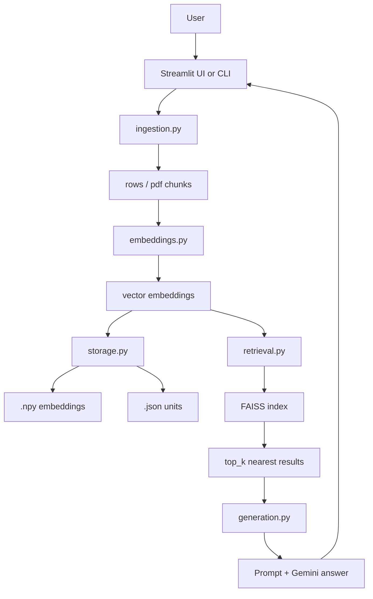
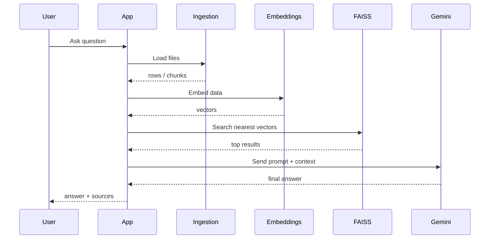

# Similarity Search + FAISS

Small guide to how this app thinks.

## 1. Big Picture

```text
User Question
     |
     v
+-------------------+
| Collect Files     |
| csv / xlsx / pdf  |
+-------------------+
     |
     v
+-------------------+
| Break Into Units  |
| rows or chunks    |
+-------------------+
     |
     v
+-------------------+
| Create Embeddings |
| text -> vectors   |
+-------------------+
     |
     v
+-------------------+
| Store / Load      |
| .npy / .json      |
+-------------------+
     |
     v
+-------------------+
| Build / Load      |
| FAISS Index       |
+-------------------+
     |
     v
+-------------------+
| Similarity Search |
| nearest vectors   |
+-------------------+
     |
     v
+-------------------+
| Build Context     |
| top matches       |
+-------------------+
     |
     v
+-------------------+
| Gemini Answer     |
+-------------------+
```

## 2. Demo Version

```text
[Question]
   "Which item is good for office travel?"
                |
                v
      [Embedding Model]
      "I turn words into numbers."
                |
                v
          [FAISS Index]
      "I find nearby numbers fast."
                |
                v
        [Best Matching Text]
      "Wireless Mouse ..."
                |
                v
            [Gemini]
      "Now I answer using that context."
```

## 3. What Is Similarity Search?

Similarity search means:

- turn text into vectors
- compare vector distance
- smaller distance = closer meaning

Example:

```text
Query: "running shoes"

Nearest:
1. Red Running Shoes
2. Blue Basketball Shoes
3. Wireless Mouse
```

The model does not match only exact words.
It tries to match meaning.

## 4. Why FAISS?

Without FAISS:

- compare query with every vector one by one
- slow when data grows

With FAISS:

- vectors are stored in a search index
- nearest matches come back fast
- better base for larger RAG apps

## 5. Architecture Map



## 6. File Roles

| File | Job |
|---|---|
| `src/app.py` | Streamlit UI |
| `src/step4_embedding_search.py` | CLI entrypoint |
| `src/ingestion.py` | load files, split PDF text |
| `src/embeddings.py` | embedding model, query vector |
| `src/storage.py` | save/load embeddings and units |
| `src/retrieval.py` | FAISS index, nearest search, metadata |
| `src/generation.py` | prompt building and Gemini answer |

## 7. PDF Path vs Table Path

```text
CSV / XLSX
   row -> "title + description + category" -> vector

PDF
   page text -> chunks -> vector
```

PDF metadata keeps:

- file path
- page number
- chunk id

Tabular metadata keeps:

- file path
- row id
- title
- category

## 8. Retrieval Flow



## 9. Stored Artifacts

```text
data/products_embeddings.npy   -> saved vectors
data/products_units.json       -> saved text units
data/products_faiss.index      -> FAISS search index
```

Why keep them?

- no need to rebuild every run
- faster app startup after first indexing

## 10. Distance Meaning

This project uses FAISS `IndexFlatL2`.

That means:

- result metric is `distance`
- lower distance = better match

```text
distance 0.76   -> very close
distance 1.90   -> weaker match
distance 3.00+  -> usually poor match
```

## 11. Full System View

```text
                +----------------------+
                |  User Question       |
                +----------+-----------+
                           |
                           v
                +----------------------+
                |  Streamlit / CLI     |
                +----------+-----------+
                           |
          +----------------+----------------+
          |                                 |
          v                                 v
+----------------------+        +----------------------+
|   CSV / XLSX Loader  |        |   PDF Chunker        |
|   structured rows    |        |   page-wise chunks   |
+----------+-----------+        +----------+-----------+
           \                               /
            \                             /
             v                           v
              +-------------------------+
              |   Embedding Model       |
              |   all-MiniLM-L6-v2      |
              +-----------+-------------+
                          |
                          v
              +-------------------------+
              |   Vector Storage        |
              |   .npy / .json          |
              +-----------+-------------+
                          |
                          v
              +-------------------------+
              |   FAISS IndexFlatL2     |
              +-----------+-------------+
                          |
                          v
              +-------------------------+
              |   Top-k Retrieval       |
              |   with metadata         |
              +-----------+-------------+
                          |
                          v
              +-------------------------+
              |   Prompt Builder        |
              +-----------+-------------+
                          |
                          v
              +-------------------------+
              |   Gemini Generation     |
              +-----------+-------------+
                          |
                          v
              +-------------------------+
              | Answer + Sources        |
              +-------------------------+
```

## 12. Good Next Steps

- switch from `IndexFlatL2` to a larger FAISS strategy when data grows
- add chunk overlap for PDFs
- add reranking after FAISS retrieval
- add filters by file, category, or page
- deploy app and store secrets safely

